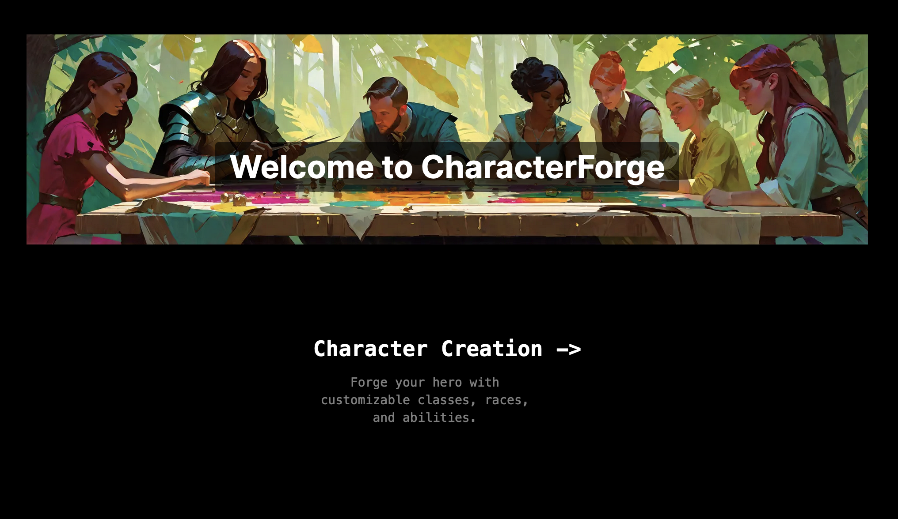
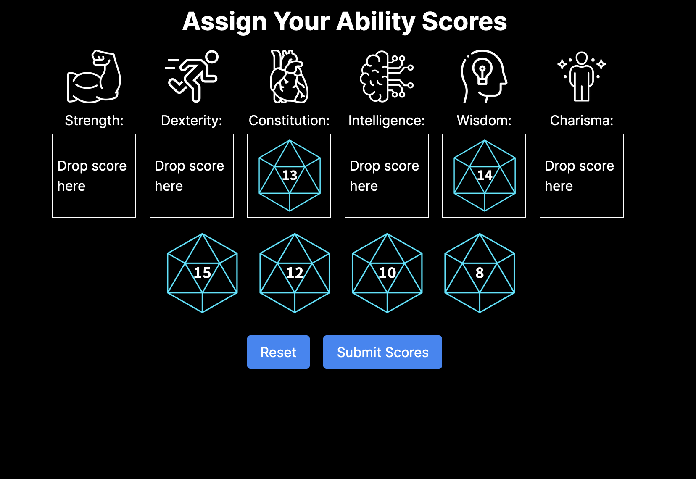

# CharacterForge
>CharacterForge is a DnD character creation tool that creates a simple and interactive character creation process for new and veteran players. 

## Table of Contents
* [Team](#team)
* [General Info](#general-information)
* [Technologies Used](#technologies-used)
* [Screenshots](#screenshots)
* [Project Status](#project-status)
* [Room for Improvement](#room-for-improvement)
* [Acknowledgements](#acknowledgements)
* [Contact](#contact)

## Team
We are a team of Texas State University students developing this project as part of our Human Factors course.

* Benu Liburd
* Ray Rojas
* John Yamamoto

## General Information
The goal of the project is to create a more interactive and simple creation process for new players unfamiliar with Dungeons and Dragons IP and veterans who want to create a simple character for new players or make simple characters for a one shot they might be running. Currently CharacterForge needs to be ran via the development server and uses Local Storage. To run the development server: 
```bash
npm run dev
```

Then open [http://localhost:3000](http://localhost:3000) with your browser to see the result.


## Technologies Used
- Next - version 14.2.1
- Pdf-lib - version 1.17.1
- React - version 18

## Screenshots





## Project-status
* Currently incomplete in it's current state. Currently the application is missing parts of the character creation system. 
* Equipment page is in Non_Operating Assets, currently not implemented into the prject in it's current state.

## Room for Improvement
* Different pdf to import to, there are some font issues leading to the team leaving them empty till solved.
* The Drag and drop feature is a little sensitive to inacurrate placement on the ablities page.
* The Collection of data such as Name, height, weight, ect... is unrefined and the drop down menu ideally should be removed.
* Storage needs to be move to a database.
* Application needs to be hosted or packaged as an app via Electron or simular products. 
* Tiefling doesn't seem to show up on race on the PDF.
* Some top fields on the PDF don't show up some of the time.

## Acknowledgements
* All art generated using the [Hotpot.ai](https://hotpot.ai/)

## Contact 
Created by Benu Libard, Ray Rojas and John Yamamoto - feel free to reach out at jmy40@txstate.edu. 

